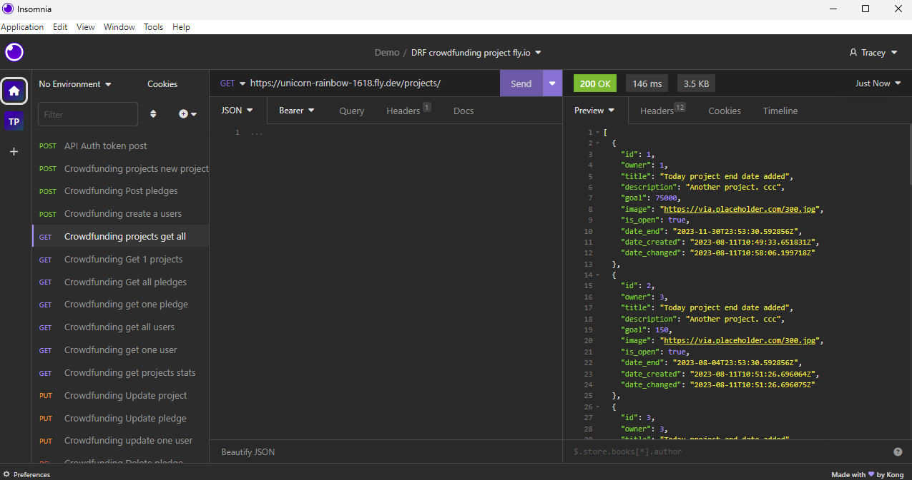
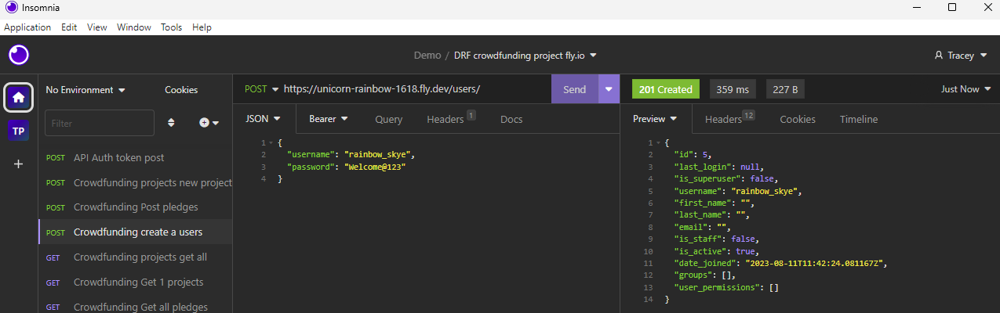
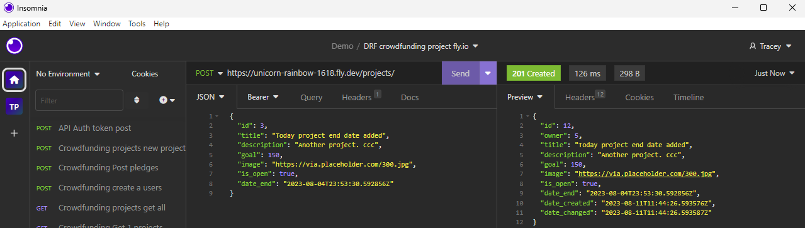
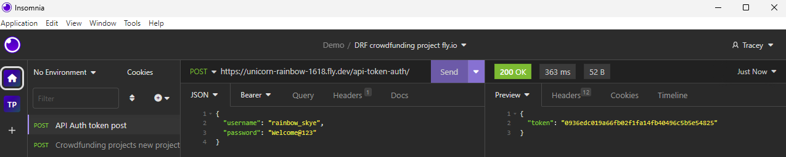
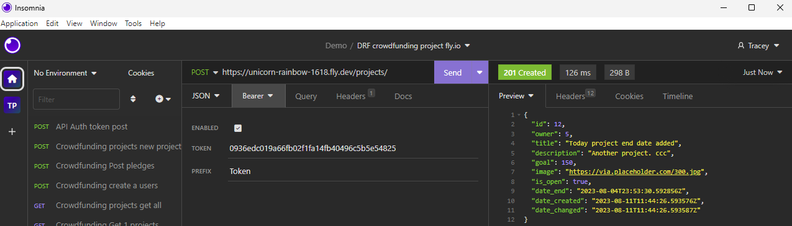

# DRF SheCodes Project - Fundling - Crowdfunding website
by Tracey Nguyen
- She Codes crowdfunding project - Django Rest Framework (DRF) Backend.

## About
"Fundling" is a crowdfunding website to enable fundraising for things related to kids events. Think of school fairs, sporting events, volunteering, camps or excursions. The site enables kids to post about an event and get awareness for community support and fundraising.

## Features

Release 1 - back end API features include:

* [X] User can Login/Logout 
    - [X] Username
    - [X] Email
    - [X] Password

* [X] User can only change their own account profile details
            
* [X] User can create, edit, display a project
    - [X] Title
    - [X] Owner (a user)
    - [X] Description
    - [X] Image
    - [X] Target amount to fundraise
    - [X] Whether it is currently open to accepting new supporters or not 
    - [X] When the project was created (auto filled on initial creation)
    - [X] When the project was changed (auto filled on create/update)
    - [X] When the project ends (user defined)
    - [X] User can edit project if they are the owner of the project    

* [X] User can make a Pledge
    - [X] An amount
    - [X] The project the pledge is for
    - [X] The supporter/user (i.e. who created the pledge)
    - [X] Whether the pledge is anonymous or not
    - [X] If the supporter is not the project owner, pledge can be created
        - [X] If the project is not currently open, pledge cannot be created               
    - [X] A comment to go along with the pledge
    - [X] User can edit pledge if the project is open and they are the supporter   
    - [X] User can delete pledge if the project is open and they are the supporter       
 
### Stretch Goals

* [X] Display statistics on the home page # projects, pledges, $, unique supporters
* [] Users:
    - [] Image
    - [] Bio
* [] Add additional fields for projects
    - [] School Name
    - [] Website
    - [] Categories
* [] Search project based on categories or title/description
* [] Change currency/language
* [] Remind me
* [] Like / Dislike
* [] Percentage funded - display as graph
* [] Days to go/ left for deadline
* [] Last donation

## API Specification

| HTTP Method | URL | Purpose | Request Body | Successful Response Code | Authentication   Authorization |
| :---: | :--- | :--- | :--- | :---: | :--- |
| GET | projects/ | Return all projects | N/A | 200 | N/A |
| GET | projects/1/ | Return the project with ID of "1" | N/A | 200 | N/A |
| GET | pledges/ | Return all pledges | N/A | 200 | N/A |
| GET | pledges/1/ | Return the pledge with ID of "1" | N/A | 200 | N/A |
| GET | users/ | Get all users | User object | 200 | N/A |
| GET | users/1/ | Return the user with ID of "1" | User object | 200 | User must be logged in |
| GET | projects/statistics/ | Return number of projects, pledges, total amount to date, number of unique supporters | N/A | 200 | N/A |
| POST | projects/ | Create a new project | Project object | 201 | User must be logged in. |
| POST | pledges/ | Create a new pledge | Pledge object | 201 | User must be logged in.  User must not be the owner of the project Project must be open|
| POST | users/ | Create a new user | User object | 201 | N/A |
| POST | api-token-auth/ | Create authentication token for user | N/A | 200 | Username and password must be supplied |
| PUT | projects/1/ | Update the project with ID of "1" | Project object | 200 | User must be logged in.  User must be the project owner |
| PUT | pledges/1/ | Update the pledge with ID of "1" | Pledge object | 200 | User must be logged in.  User must be the pledge owner Project must be open |
| PUT | users/1/ | Update the user with ID of "1" | User object | 200 | User must be logged in and can only edit own account |
| DELETE | pledges/1/ | Deletes the pledge with ID of "1" | Project object | 204 | User must be logged in.  User must be the pledge owner Project must be open |

## Database Schema
Created with dbdiagram.io

## Submission Documentation

Deployed Project: [https://unicorn-rainbow-1618.fly.dev/projects/](https://unicorn-rainbow-1618.fly.dev/projects/)

### How To Run

Steps to call APIs

* All POST, PUT, DELETE methods use Bearer Token for user authentication in Insomnia

| HTTP Method | URL | Request Body (json) | Successful Response Code | 
| :---: | :--- | :--- | :---: | 
| GET | https://unicorn-rainbow-1618.fly.dev/projects/ | N/A | 200 |
| GET | https://unicorn-rainbow-1618.fly.dev/projects/1/ | N/A| 200 | 
| GET | https://unicorn-rainbow-1618.fly.dev/pledges/ | N/A| 200 | 
| GET | https://unicorn-rainbow-1618.fly.dev/pledges/1/ | N/A | 200 |  
| GET | https://unicorn-rainbow-1618.fly.dev/users/ | N/A| 200 |  
| GET | https://unicorn-rainbow-1618.fly.dev/users/1/ | N/A | 200 |  
| GET | https://unicorn-rainbow-1618.fly.dev/projects/statistics/ | N/A | 200 |  
| POST | https://unicorn-rainbow-1618.fly.dev/projects/ | {  <ul> title": "Project Title",   	"description": "Project description",   	"goal": 10000,   	"image": "https://via.placeholder.com/300.jpg", "is_open": true,  	"date_end": "2023-10-31T23:53:30.592856Z" </ul> } | 201 | 
| POST | https://unicorn-rainbow-1618.fly.dev/pledges/ | { <ul>	"supporter": 1, 	"amount": 100000, 	"comment": "Love this project!", 	"anonymous": false, 	"project": 4 </ul>} | 201 | 
| POST | https://unicorn-rainbow-1618.fly.dev/users/ | {  <ul> 	"username": "new_user",  	"password": "Welcome@123"  </ul>} | 201 |  
| POST | https://unicorn-rainbow-1618.fly.dev/api-token-auth/ |  {  <ul> 	"username": "new_user",  	"password": "Welcome@123"  </ul>} | 200 |  
| PUT | https://unicorn-rainbow-1618.fly.dev/projects/1/ | { <ul>"title": "Project title", 	"description": "Project updated", 	"goal": 75000, "image": https://via.placeholder.com/300.jpg", 	"date_end": "2023-11-30T23:53:30.592856Z" </ul>} | 200 | 
| PUT | https://unicorn-rainbow-1618.fly.dev/pledges/1/ | { <ul>	"supporter": 1, 	"amount": 100000, 	"comment": "Love this project!", 	"anonymous": false, 	"project": 4 </ul>}  | 200 |  
| PUT | https://unicorn-rainbow-1618.fly.dev/users/1/ | { <ul>	"username": "new_user",  	"first_name": "Moon", 	"last_name": "Sparkle", 	"email": "moon@sparkle.com" </ul>} | 200 |  
| DELETE | https://unicorn-rainbow-1618.fly.dev/pledges/1/ | N/A | 204 |  

### How To Register a New User

Step by step instructions for how to register a new user and create a new project (i.e. endpoints and body data). 

| Step | HTTP Method | URL | Request Body (json) | Successful Response Code | Authentication   Authorization | 
| :---: | :---: | :---: | :--- | :---: | :---: | 
| 1 | POST | https://unicorn-rainbow-1618.fly.dev/users/ | {   <ul>	"username": "admin",  	"password": "password@123" </ul> }| 201 | N/A | 
| 2 | POST | https://unicorn-rainbow-1618.fly.dev/api-token-auth/ |{   <ul>	"username": "admin",  	"password": "password@123" </ul> } | 200 | Username and password |
| 3 | POST | https://unicorn-rainbow-1618.fly.dev/projects/ |{ <ul>"title": "Project Title", 	"description": "Description of Project", 	"goal": 1000, 	"image": "https://via.placeholder.com/300.jpg", 	"is_open": true, 	"date_end": "2023-12-31T23:53:30.592856Z" </ul>} | 201 | Select Auth Type="Bearer Token", Enabled="Ticked", Token= Copy & paste the token from Step 2, Prefix = "Token" |
 

### Screenshots

| A screenshot of Insomnia, demonstrating a successful GET method for any endpoint. |
| :--- |
|  |

| A screenshot of Insomnia, demonstrating a successful POST method for any endpoint. |
| :--- |
|  |
|  |

| A screenshot of Insomnia, demonstrating a token being returned. |
| :--- |
|  |

| A screenshot of Insomnia, demonstrating usage of a bearer token as authentication type|
| :--- |
|  |

## Release 2 - Front End Website

### Wireframes

{{ Insert your wireframes }}

### Colour Scheme
{{ Insert your colour scheme }}

### Fonts
{{ outline your heading & body font(s) }}